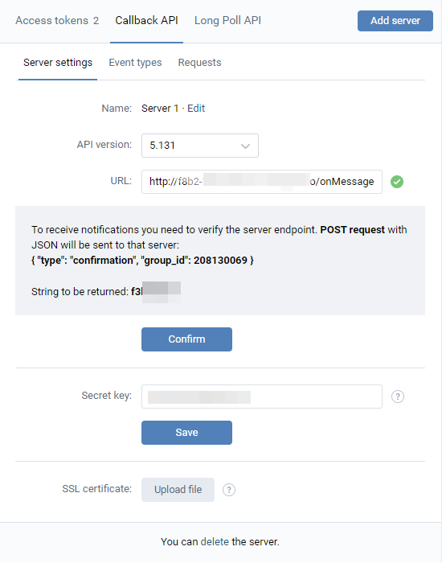

If u want to start a bot u need to execute next steps:

1. u need to generate a access token (for community) and write it to vk_secret.yml
2. forward ports from localhost to ngrok url 
```
ngrok.exe http 8080
```
3. register callback server in group's settings > API usage > Callback API
4. copy url from console (e.g.  https://f8b2-188-236-74-100.ngrok.io) and to write to URL + /onMessage
   
5. and copy confirmation_code and group_id from "String to be returned" and write to vk_secret.yml
6. execute command
```
./gradlew bootRun
```
